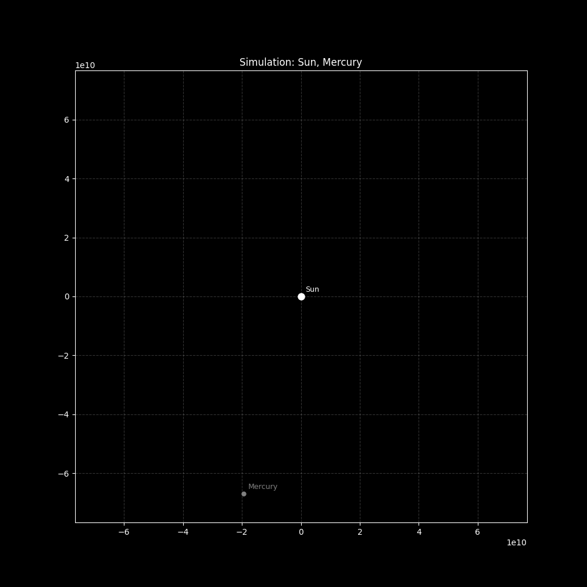

# 🪐 Mercury Orbital Precession Simulation


Численное моделирование орбитального движения Меркурия. Проект демонстрирует прецессию перигелия, возникающую вследствие релятивистских эффектов (ОТО), используя симплектический интегратор и модульную систему сил.

> **Результат симуляции:**
>
> 

## 📂 Структура проекта

Проект разделен на логические модули для удобства поддержки и расширения:

```text
.
├── assets/             # Папка для сохранения результатов
│   ├── orbit.gif       # Анимированная визуализация орбиты
│   └── sim.png         # Статический график траектории
├── main.py             # Точка входа: настройки, физические формулы и цикл симуляции
├── models.py           # Основные классы данных (Planet, Forces)
├── visualizer.py       # Логика рендеринга и создания анимации (Matplotlib)
├── .gitignore          # Исключения для Git
└── README.md           # Документация

```

## 🛠 Установка и запуск

### Требования

* Python 3.8+
* Библиотеки: `numpy`, `matplotlib`

### Инструкция

1. **Клонируйте репозиторий:**
```bash
git clone [https://github.com/your-username/mercury-precession.git](https://github.com/your-username/mercury-precession.git)
cd mercury-precession

```


2. **Установите зависимости:**
```bash
pip install numpy matplotlib

```


3. **Запустите симуляцию:**
```bash
python main.py

```


После запуска скрипт проведет вычисления, сохранит график в `assets/sim.png` и сгенерирует анимацию `assets/orbit.gif`.

## 🧮 Физическая модель и Архитектура

### 1. Интегратор

Используется метод **Velocity Verlet** (реализован в функциях `move_calculate` и `acc_calculate` в `main.py`). Это симплектический метод второго порядка точности, который сохраняет полную энергию системы на больших интервалах времени, что критично для орбитальных симуляций.

### 2. Система сил (Strategy Pattern)

В файле `models.py` реализован класс `Forces`, который работает как реестр. Это позволяет легко комбинировать различные физические взаимодействия.

В данный момент в `main.py` зарегистрированы две силы:

* **`NewtonF`**: Классическое Ньютоновское притяжение.
* **`EinsteinF`**: Релятивистская поправка к ускорению, отвечающая за поворот орбиты (прецессию).

### 3. Визуализация

Модуль `visualizer.py` использует `matplotlib.animation` для создания GIF. Скрипт автоматически:

* Подстраивает масштаб графика под орбиту.
* Рисует "хвост" траектории (параметр `trace_length`).
* Прореживает кадры (`stride`) для оптимизации размера файла анимации.

## 💻 Пример использования (код)

Добавление новой силы в симуляцию делается через регистрацию функции:

```python
from models import Forces

# 1. Определяем новую силу (например, сопротивление среды)
def DragForce(p1, p2):
    return -0.01 * p1.u # Простой пример

# 2. Инициализируем реестр
forces = Forces(dim=np.array([0, 0]))

# 3. Регистрируем силы
forces.registrate(NewtonF)
forces.registrate(DragForce)

# Теперь симуляция автоматически учитывает оба эффекта

```

## 📈 Результаты

На выходе получается анимация, наглядно показывающая движение планеты вокруг Солнца. При изменении констант (например, увеличении `G` или уменьшении `C` в `main.py`) можно визуально наблюдать эффект смещения перигелия ("розетку").

---

*Educational project.*

