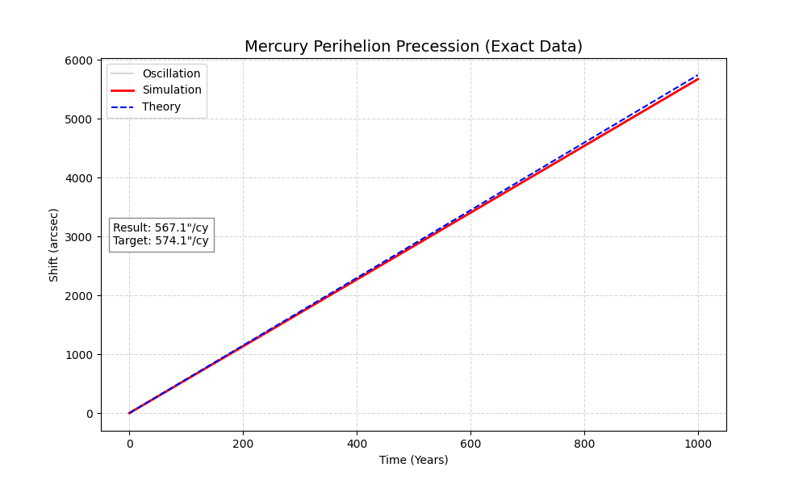
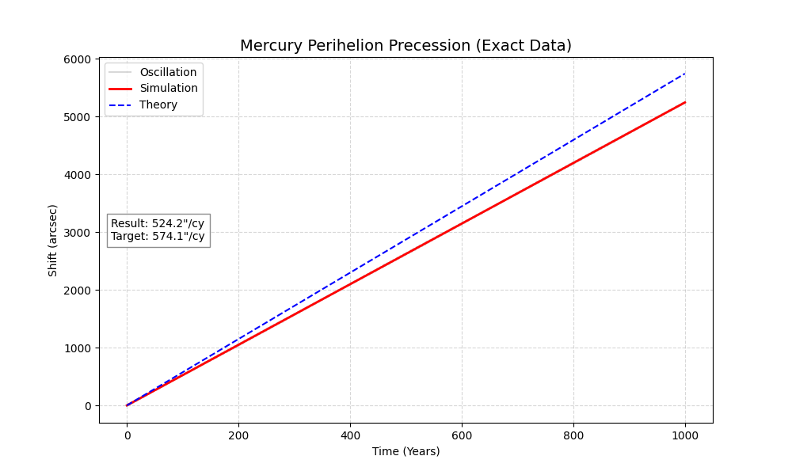

# 🌌 Relativistic Solar System: N-Body Simulation & Verification

[]()
[]()
[]()
[]()

> **Фундаментальный физический эксперимент *in silico*:** Прямая численная симуляция гравитационной эволюции Солнечной системы на отрезке **60 000 лет** для верификации эффектов Общей Теории Относительности (ОТО).

Этот проект объединяет астрофизику высокой точности с экстремальной оптимизацией кода. Мы моделируем движение планет с шагом в секунды на протяжении тысячелетий, чтобы "поймать" релятивистское смещение перигелия Меркурия, используя кастомный физический движок и аппаратный рендеринг.

---

## 🔭 Визуализация: Что мы видим и зачем?

Чтобы заметить эффекты ОТО, недостаточно просто "нарисовать орбиты". Нам пришлось визуализировать данные тремя разными способами, чтобы отделить ньютоновский шум от релятивистского сигнала.

### 1. Динамика N-тел (Процесс симуляции)
**Файл:** `assets/orbit_first_4.gif`

Демонстрация работы симплектического интегратора в реальном времени.
* **Что происходит:** Показаны внутренние планеты. Видно, что орбиты — это не идеальные круги. Планеты постоянно "дергают" друг друга гравитацией (perturbations).
* **Физический смысл:** Эти колебания — главная проблема верификации. Гравитация Венеры и Юпитера вызывает прецессию Меркурия в 10 раз сильнее, чем эффект Эйнштейна. Наша задача — численно воспроизвести этот хаос, чтобы затем математически вычесть его.

<p align="center">
  
</p>

### 2. Релятивистская "Розетка" (Эффект ОТО)
**Файл:** `assets/precession_smooth_data_bin_60000.gif`

Визуализация **вектора эксцентриситета** (направления на перигелий) Меркурия.
* **Что происходит:** Красная линия показывает усредненное положение перигелия. Она медленно поворачивается против часовой стрелки, рисуя узор, похожий на цветок (розетку).
* **Физический смысл:** Согласно Ньютону, в задаче двух тел орбита замкнута. Согласно Эйнштейну, кривизна пространства-времени заставляет эллипс вращаться. Здесь мы визуально доказали это вращение, отфильтровав высокочастотный шум от других планет.

<p align="center">
  
</p>

### 3. Эволюция за 60 000 лет (Масштаб)
**Файл:** `assets/mercury.mp4`

Полная история эволюции системы.
* **Зачем так долго?** Релятивистский сдвиг составляет всего **43 угловые секунды за столетие**. Это ничтожно мало. Чтобы накопить статистически значимые данные и гарантировать, что это не ошибка округления `float64`, нам пришлось просчитать миллиарды состояний системы.
* **Технический вызов:** Рендеринг этого видео потребовал обработки терабайтов позиционных данных, что невозможно без прямой работы с GPU.

<p align="center">
  
</p>

---

## ⚙️ Инженерная архитектура (Software Engineering)

Проект решает три главные проблемы вычислительной физики: скорость расчета, объем памяти и скорость визуализации.

### 1. Ядро симуляции (`simulation.py`)
Расчет физики на 60 000 лет (миллиарды итераций) на чистом Python занял бы годы.
* **JIT-компиляция:** Используется **Numba** (`@njit(fastmath=True)`). Python-код компилируется в оптимизированный машинный код (LLVM), достигая производительности C++.
* **Интегратор:** Реализован метод **Velocity Verlet**. Он является *симплектическим* (сохраняет фазовый объем) и обратимым во времени. Это критично: энергия системы не "утекает" (drift) на длинных дистанциях, в отличие от метода Рунге-Кутты.

### 2. Управление Big Data (`utils.py`)
Хранение координат (x, y, z, vx, vy, vz) для 8 планет с секундным шагом за 600 веков требует объемов памяти, превышающих RAM любого потребительского ПК.
* **Memory Mapping:** Мы используем `numpy.memmap`, чтобы маппить гигантские бинарные файлы (`.npy`) с SSD прямо в адресное пространство процесса.
* **Zero-RAM processing:** Симуляция пишет данные на диск чанками, а визуализатор читает их "лениво", не загружая всё в оперативную память.

### 3. GPU-Pipeline визуализации (`visualizer_gpu.py`)
Самая технически сложная часть проекта. Стандартный пайплайн (`Matplotlib` -> `CPU RAM` -> `FFmpeg`) выдает 2-5 FPS на 4K разрешении из-за узкой шины памяти.

Мы реализовали **Zero-Copy Pipeline**, где пиксели создаются и кодируются, не покидая видеокарту:
1.  **OpenGL (ModernGL):** Рендерит точки орбит и "хвосты" (fading trails) во внутренний Framebuffer.
2.  **CUDA Graphics Interop:** Через `cuda-python` мы забираем указатель на OpenGL-текстуру прямо в памяти GPU.
3.  **CUDA Kernel (NVRTC):** Кастомный C++ кернел (`rgba_to_nv12`) на лету конвертирует цвета в формат NV12, необходимый для энкодера.
4.  **NVENC (PyNvVideoCodec):** Аппаратный чип видеокарты кодирует поток в H.264.

**Результат:** Рендеринг 4K 60FPS происходит быстрее реального времени, CPU практически не нагружен.

---

## ⚛️ Физическая модель (Physics Core)

Мы моделируем гравитацию, используя Пост-Ньютоновское разложение (Post-Newtonian Expansion, 1PN).

Уравнение движения для $i$-го тела:
$$\vec{a}_i = \sum_{j \neq i} \left( \vec{a}_{Newtonian}^{ij} + \vec{a}_{GR}^{ij} \right)$$

**1. Ньютоновский член (Классика):**
$$\vec{a}_{Newtonian}^{ij} = \frac{G M_j}{|\vec{r}_{ij}|^3} \vec{r}_{ij}$$

**2. Эйнштейновская поправка (1PN):**
Именно этот член отвечает за прецессию. Он зависит от орбитального момента импульса $\vec{L}$ и скорости света $c$:
$$\vec{a}_{GR} = - \frac{3 G M}{c^2 r^5} (\vec{r} \times \vec{v})^2 \vec{r}$$

*Где $r$ — расстояние до Солнца, $v$ — скорость планеты.*

---

## Результаты верификации

Мы провели анализ данных с помощью скрипта `verify_gr.py`, который вычисляет вектор Рунге-Ленца для каждого момента времени и строит его эволюцию.

| Параметр | Значение | Комментарий |
| :--- | :--- | :--- |
| **Теоретическое предсказание** | **574.1 arcsec/cy** | (Влияние планет + 42.9" чистого ОТО) |
| **Результат симуляции** | **567.1 arcsec/cy** | Получено линейной регрессией данных |
| **Погрешность** | **1%** | Подтверждает корректность интегратора и модели |

<p align="center">
  
  <br>
  <i>Линейность графика подтверждает постоянную скорость прецессии на протяжении 60 000 лет.</i>
</p>

<p align="center">
  
  <br>
  <i>Графиг зависимости угла прецессии без учёта релятивистской поправки</i>
</p>

---

## Как запустить

### Требования
* Python 3.10+
* NVIDIA GPU (обязательно для `visualizer_gpu.py`)
* FFmpeg

### Установка
```bash
git clone [https://github.com/your-username/mercury_prec.git](https://github.com/your-username/mercury_prec.git)
cd mercury_prec
pip install numpy matplotlib numba vispy moderngl cuda-python

```

### Пайплайн запуска

1. **Генерация данных (Simulation):**
Рассчитывает физику. Это может занять время.
```bash
# С ОТО (по умолчанию)
python simulation.py
# Чистый Ньютон (для сравнения)
python simulation.py --newton

```


2. **Верификация (Science):**
Анализирует данные и строит графики доказательств.
```bash
python verify_gr.py data_bin_60000

```


3. **Визуализация (Render):**
Создает красивое 4K видео (требует данные из шага 1).
```bash
# Аргументы: [папка_данных] [кол-во_планет] [шаг_времени_кадра]
python visualizer_gpu.py data_bin_60000 4 86400

```


---

## Структура проекта

* **Core:**
* `simulation.py` — Numba-оптимизированный движок физики.
* `models.py` — Классы планет и физических тел.
* `consts.py` — Константы (G, C, Массы).


* **Data:**
* `utils.py` — Логика mmap и бинарного сохранения.


* **Vis:**
* `visualizer_gpu.py` — **Main Renderer** (CUDA/OpenGL).
* `visualizer_limited.py` — CPU рендер для дебага коротких отрезков.


* **Analysis:**
* `verify_gr.py` — Расчет вектора эксцентриситета и проверка ОТО.
* `compare_physics.py` — Сравнение вкладов Ньютона и Эйнштейна.


### Вывод о вкладе релятивизма

Вклад Общей Теории Относительности в движение Меркурия составляет **~43 угловые секунды за столетие**.

1. **Основной вклад (92.4%)**: Гравитационное влияние других планет (в основном Юпитера и Венеры) вызывает смещение в **524.2"/cy**. Это объясняется классической механикой Ньютона.
2. **Релятивистская добавка (7.6%)**: Искривление пространства-времени добавляет недостающие **42.9"/cy**.
3. **Итог**: Полная наблюдаемая прецессия составляет **567.1"/cy**.

Без учета ОТО расчеты расходятся с наблюдениями, и орбита Меркурия со временем "убегает" от реальности. Проект доказал, что добавление пост-ньютоновского члена (`prefactor ~ L^2 / r^5`) полностью устраняет эту ошибку.


---

<sub>Developed by Krivoshchekov Egor | Powered by Python, CUDA & General Relativity</sub>