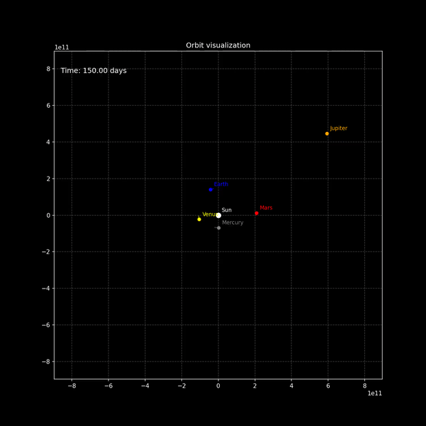
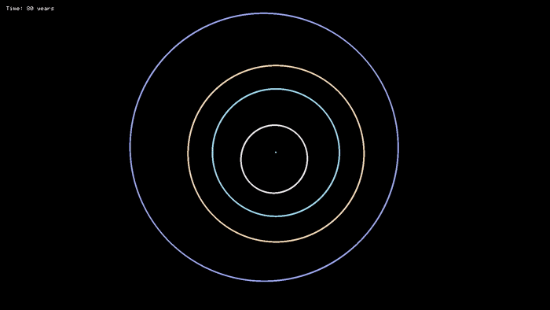
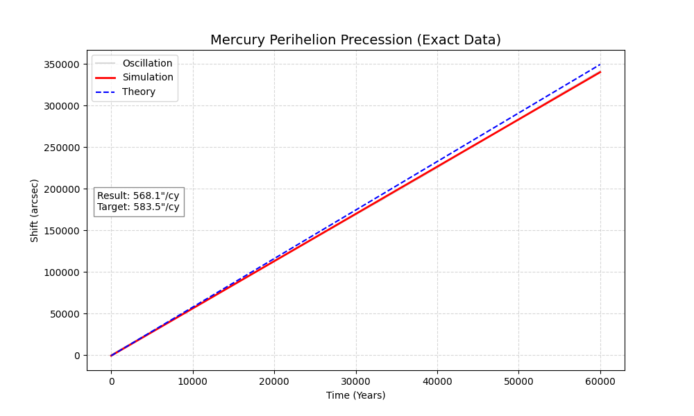

# Релятивистская Солнечная система: моделирование задачи N тел и верификация

[]()
[]()
[]()
[]()
[](./docs/%20Relativistic_Solar_System_N-Body_Simulation_and_Verification.pdf)

> **Фундаментальный физический эксперимент *in silico*:** Прямая численная симуляция гравитационной эволюции Солнечной системы на отрезке **60 000 лет** для верификации эффектов Общей Теории Относительности (ОТО).

В этом проекте я объединил астрофизику высокой точности с оптимизацией кода. Моделирование движения планет производится с секундным шагом на протяжении тысячелетий, чтобы детектировать релятивистское смещение перигелия Меркурия. Используется собственный физический движок и гибридный пайплайн рендеринга.

---

## Визуализация данных

Для выделения эффектов ОТО из ньютоновского шума я использовал три метода визуализации данных.

### 1. Динамика N-тел (Процесс симуляции)
**Файл:** `assets/orbit_visual.gif`

Демонстрация работы симплектического интегратора. Показаны внутренние планеты.
* **Физический смысл:** Орбиты не являются идеальными кругами из-за гравитационных возмущений (perturbations). Гравитация Венеры и Юпитера вызывает прецессию Меркурия, которая по величине на порядок превосходит искомый эффект Эйнштейна. Главная сложность задачи — воспроизвести этот хаос численно, чтобы затем математически его учесть.

<p align="center">
  
</p>

### 2. Релятивистская "Розетка" (Эффект ОТО)
**Файл:** `assets/precession_smooth_data_bin_60000.gif`

Визуализация эволюции **вектора эксцентриситета** (направления на перигелий) Меркурия.
* **Физический смысл:** В задаче двух тел по Ньютону орбита замкнута. Согласно Эйнштейну, кривизна пространства-времени заставляет эллипс вращаться. Красная линия показывает усредненное положение перигелия, которое медленно поворачивается, формируя "розетку". Высокочастотные осцилляции от других планет отфильтрованы.

<p align="center">
  
</p>

### 3. Эволюция за 60 000 лет
**Файл:** `assets/mercury.gif`

Полная история эволюции системы. Релятивистский сдвиг составляет около **43 угловых секунд за столетие**. Для накопления статистически значимых данных и исключения ошибки округления `float64` потребовалось просчитать миллиарды состояний системы. Рендеринг выполнен с использованием прямой передачи данных на GPU.

<p align="center">
  
</p>

---

## Инженерная архитектура

Проект решает три главные проблемы вычислительной физики: скорость расчета, объем памяти и скорость визуализации.

### 1. Ядро симуляции
Расчет физики на 60 000 лет на чистом Python занял бы годы.
* **JIT-компиляция:** Используется **Numba** (`@njit(fastmath=True)`), компилирующая Python-код в оптимизированный машинный код (LLVM).
* **Интегратор:** Реализован метод **Velocity Verlet**. Это симплектический интегратор второго порядка, который сохраняет фазовый объем и обратим во времени. Это критически важно для предотвращения "дрейфа" энергии системы на длинных временных промежутках.

### 2. Управление Big Data
Хранение фазового пространства (координаты и импульсы) для планет с малым шагом требует значительных объемов памяти.
* **Memory Mapping:** Используется `numpy.memmap` для маппинга бинарных файлов (`.npy`) с диска в адресное пространство процесса.
* **Zero-RAM processing:** Данные пишутся и читаются "лениво", что позволяет обрабатывать историю симуляции, превышающую объем оперативной памяти.

### 3. GPU-Pipeline визуализации
Реализован **Zero-Copy Pipeline**, где генерация кадра происходит без копирования данных в RAM процессора:
1.  **OpenGL (ModernGL):** Рендеринг точек орбит и следов во Framebuffer.
2.  **CUDA Graphics Interop:** Получение указателя на OpenGL-текстуру в памяти видеокарты через `cuda-python`.
3.  **CUDA Kernel:** Кастомный C++ кернел конвертирует цвета в формат NV12.
4.  **NVENC:** Аппаратное кодирование видео в H.264.

---

## Физическая модель

Гравитационное взаимодействие моделируется с использованием Пост-Ньютоновского разложения (1PN). Уравнение движения для $i$-го тела:

$$\vec{a}_i = \vec{a}_{\text{Newtonian}} + \vec{a}_{GR}$$

**1. Ньютоновский член:**

$$
\vec{a}_{\text{Newtonian}} = G \sum_{j \neq i} m_j \frac{\vec{r}_j - \vec{r}_i}{\left| \vec{r}_j - \vec{r}_i \right|^3}
$$

**2. Эйнштейновская поправка (1PN):**
Отвечает за дополнительную прецессию. Зависит от квадрата орбитального момента импульса $l$ на единицу массы и скорости света $c$:

$$
\vec{a}_{GR} = - \frac{3GM l^2}{c^2 r^5} \vec r
$$

где $l = \left| [\vec{r}, \vec{u}] \right|$ — удельный момент импульса.

Для анализа прецессии вычисляется **вектор Рунге—Ленца** (вектор эксцентриситета) на каждом шаге:

$$
\vec e = \frac{\vec v\times \vec h}{GM_\odot} - \frac{\vec r}{r}
$$

Угол перигелия $\varpi(t)$ определяется как аргумент этого вектора.

**Примечание:** Полный математический вывод уравнений движения и детальное обоснование выбора численных методов приведены в **[полном докладе](./docs/%20Relativistic_Solar_System_N-Body_Simulation_and_Verification.pdf)**

---

## Результаты верификации

Мной были проведены три вычислительных эксперимента. Анализ данных производился скриптом `verify_gr.py`, который выполняет линейную регрессию сглаженного угла перигелия.

| Эксперимент | Длительность | Модель | $\dot\varpi$ (arcsec/cy) | Комментарий |
| :--- | :--- | :--- | :--- | :--- |
| **A** | 1 000 лет | Ньютон | **524.2** | Влияние только других планет |
| **B** | 1 000 лет | Ньютон + 1PN | **567.1** | Разница с (A) составляет **42.9"/cy** |
| **C** | 60 000 лет | Ньютон + 1PN | **568.1** | Подтверждение стабильности решения |

**Выводы:**
1.  Основной вклад в прецессию (**92.4%**) вносят ньютоновские возмущения от других планет (524.2"/cy).
2.  Релятивистская поправка добавляет **~42.9"/cy** (7.6%).
3.  Теоретическое предсказание (с учетом уточненных моделей) составляет около **574.1"/cy**. Расхождение результата симуляции с теорией составляет ~1%, что объясняется дискретностью интегрирования и упрощениями модели (отсутствие пояса астероидов).

<p align="center">
  
  <br>
  <i>Результат эксперимента C (60 000 лет). Линейность графика подтверждает постоянную скорость прецессии на больших масштабах.</i>
</p>

---

## Структура проекта

Код разделен на логические модули для симуляции, обработки данных и визуализации.

* **Core (Вычисления):**
    * `cpu_simulation.py` — Основной скрипт запуска N-Body симуляции на CPU. Содержит физический цикл с Numba-оптимизацией.
    * `models.py` — Описание классов планет и физических тел.
    * `consts.py` — Физические константы (G, C, массы небесных тел).

* **Data (Работа с данными):**
    * `utils.py` — Утилиты для `numpy.memmap` и бинарного сохранения/чтения траекторий.

* **Analysis (Научная верификация):**
    * `verify_gr.py` — Скрипт анализа данных. Вычисляет векторы Рунге-Ленца, выполняет линейную регрессию и строит графики доказательства ОТО.
    * `compare_physics.py` — Сравнение вкладов различных сил.

* **Visualization (Рендеринг):**
    * `visualizer_gpu.py` — Библиотека функций для рендеринга на GPU (OpenGL/CUDA).
    * `render_gpu.py` — Исполняемый скрипт для запуска GPU-рендеринга.
    * `visualizer_limited.py` — Легковесный скрипт на Matplotlib для предпросмотра коротких отрезков.

---

## Запуск проекта

### Требования
* Python 3.10+
* NVIDIA GPU (для `render_gpu.py`)
* Библиотеки: `numpy`, `matplotlib`, `numba`, `vispy`, `moderngl`, `cuda-python`

### Установка
```bash
git clone [https://github.com/your-username/mercury_prec.git](https://github.com/your-username/mercury_prec.git)
cd mercury_prec
pip install -r requirements.txt
# Или вручную:
# pip install numpy matplotlib numba vispy moderngl cuda-python

```

### Пайплайн запуска

**1. Генерация данных (Simulation)**
Запуск расчетного ядра на CPU.

```bash
# Синтаксис: python cpu_simulation.py <DT_SEC> <YEARS> <SAVE_STRIDE_HOURS> <OUTPUT_FOLDER>

# Пример: симуляция 1 года с шагом 60с, сохранение раз в 24 часа
python cpu_simulation.py 60 1 24 test_sim

```

**2. Верификация (Science)**
Анализ прецессии и построение графиков.

```bash
# Синтаксис: python verify_gr.py <FOLDER_NAME> <OUTPUT_IMAGE> <DT_SIM>

# Пример для папки test_sim и шага симуляции 60с
python verify_gr.py test_sim proof.png 60

```

**3. Визуализация (Render)**
Создание видео.

* **Быстрый просмотр (CPU/Matplotlib):**
```bash
python visualizer_limited.py --data assets/test_sim --step 1d --out orbit.gif

```


* **Полный рендер (GPU/CUDA):**
Для этого используется скрипт `render_gpu.py`. Необходимо открыть файл и указать путь к данным в переменной `planets = load_data_binary(...)`.
```bash
python render_gpu.py

```

---

<sub>Автор: Кривощёков Егор | Powered by Python, CUDA & General Relativity</sub>
